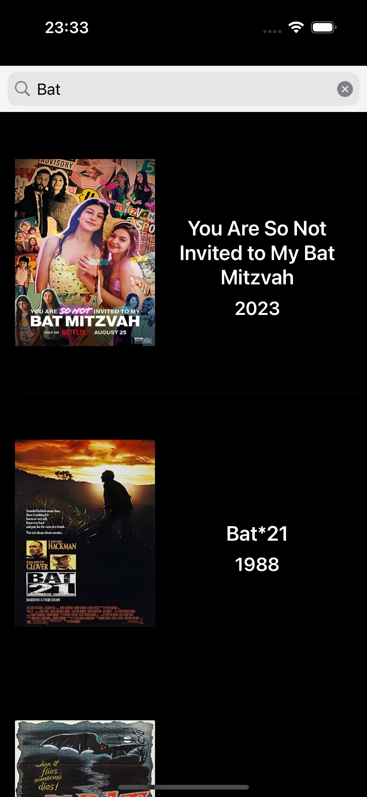
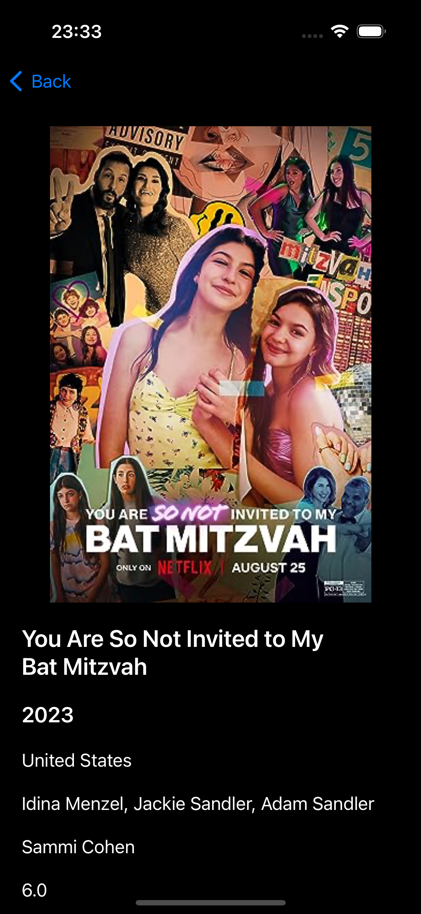
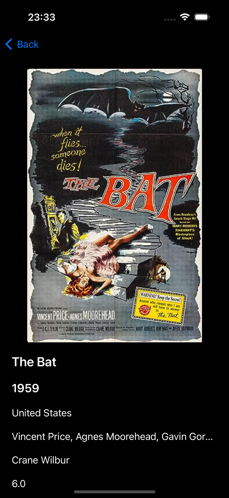

# Movie App with OMDB

This app allows users to search for movies using the OMDB API and view their details. The application includes the following features:

- Protocol Oriented Programming (POP) usage.
- URLSession for API requests.
- Programmatic user interface.
- MVVM (Model-View-ViewModel) architecture.
- Communication using the Delegate Pattern.
- Search bar for movie search.
- Movie details page.

